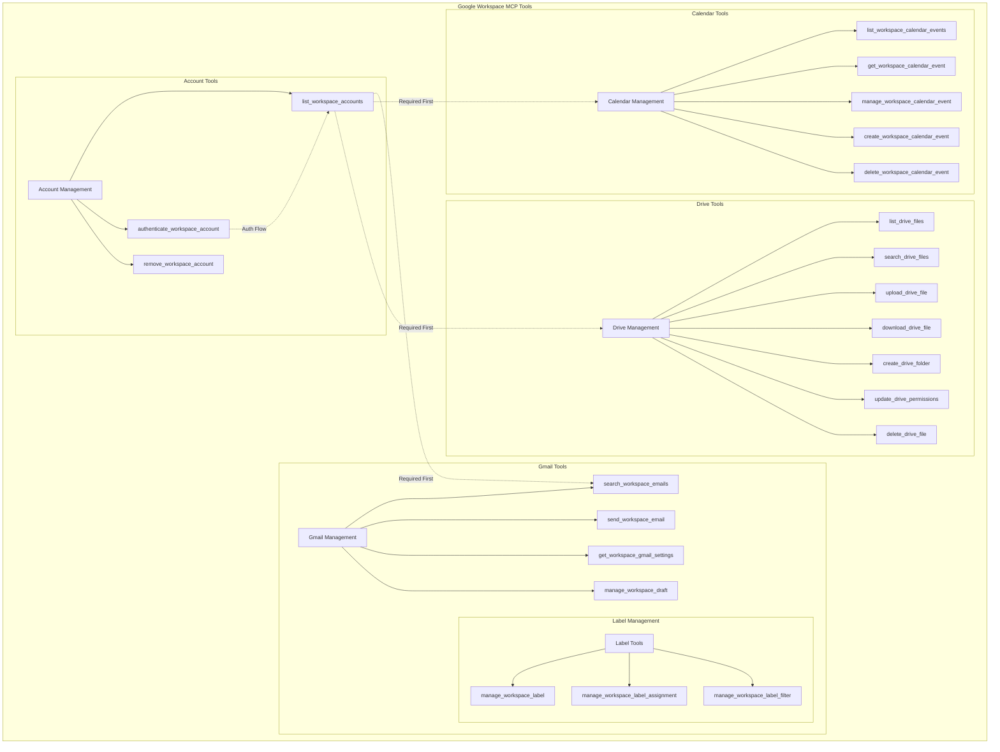
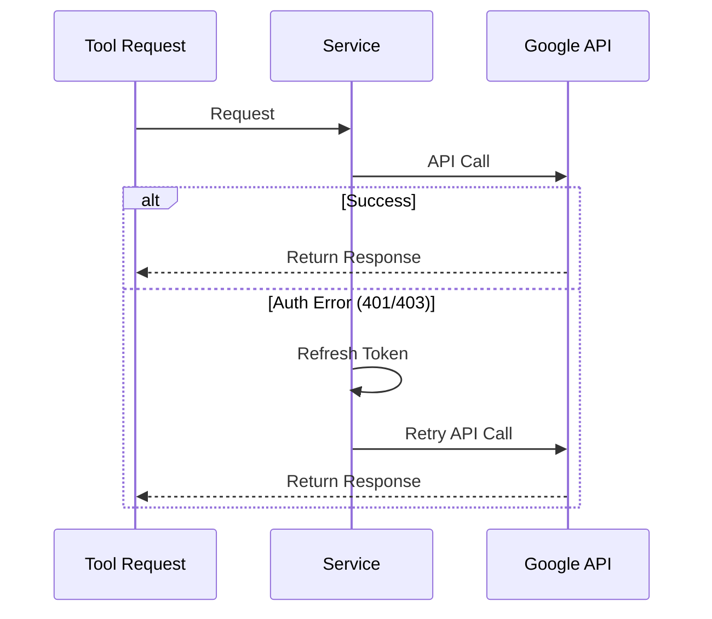
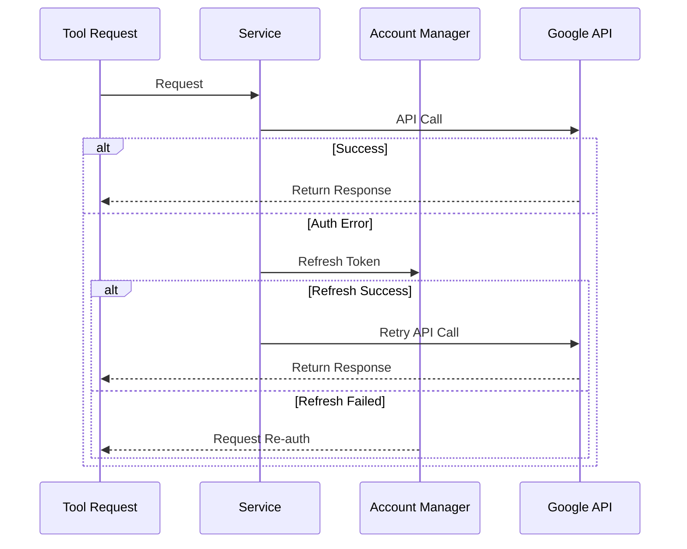
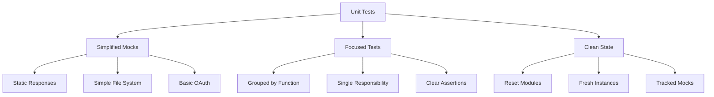

# Architecture

## Design Philosophy: Simplest Viable Design

This project follows the "simplest viable design" principle, which emerged from our experience with AI systems' tendency toward over-engineering, particularly in OAuth scope handling. This principle addresses a pattern we term "scope fondling" - where AI systems optimize for maximum anticipated flexibility rather than minimal necessary permissions.

Key aspects of this approach:
- Minimize complexity in permission structures
- Handle auth through simple HTTP response codes (401/403)
- Move OAuth mechanics entirely into platform infrastructure
- Present simple verb-noun interfaces to AI agents
- Focus on core operational requirements over edge cases

This principle helps prevent goal misgeneralization, where AI systems might otherwise create unnecessary complexity in authentication paths, connection management, and permission hierarchies.

## System Overview

The Google Workspace MCP Server implements a modular architecture with comprehensive support for Gmail, Calendar, and Drive services. The system is built around core modules that handle authentication, account management, and service-specific operations.



Key characteristics:
- Authentication-first architecture with list_workspace_accounts as the foundation
- Comprehensive service modules for Gmail, Calendar, and Drive
- Integrated label management within Gmail
- Rich tool sets for each service domain

## Core Components

### 1. Scope Registry (src/modules/tools/scope-registry.ts)
- Simple scope collection system for OAuth
- Gathers required scopes at startup
- Used for initial auth setup and validation
- Handles runtime scope verification

### 2. MCP Server (src/index.ts)
- Registers and manages available tools
- Handles request routing and validation
- Provides consistent error handling
- Manages server lifecycle

### 3. Account Module (src/modules/accounts/*)
- OAuth Client:
  - Implements Google OAuth 2.0 flow
  - Handles token exchange and refresh
  - Provides authentication URLs
  - Manages client credentials
- Token Manager:
  - Handles token lifecycle
  - Validates and refreshes tokens
  - Manages token storage
- Account Manager:
  - Manages account configurations
  - Handles account persistence
  - Validates account status

### 4. Service Modules

#### Attachment System
- Singleton-based attachment management:
  - AttachmentIndexService: Central metadata cache with size limits
  - AttachmentResponseTransformer: Handles response simplification
  - AttachmentCleanupService: Manages cache expiry
- Cache Management:
  - Map-based storage using messageId + filename as key
  - Built-in size limit (256 entries)
  - Automatic expiry handling (1 hour timeout)
  - LRU-style cleanup for capacity management
- Abstraction Layers:
  - Service layer for Gmail/Calendar operations
  - Transformer layer for response formatting
  - Index layer for metadata storage
  - Cleanup layer for maintenance

#### Gmail Module (src/modules/gmail/*)
- Comprehensive email operations:
  - Email search and sending
  - Draft management
  - Label and filter control
  - Settings configuration
  - Simplified attachment handling
- Manages Gmail API integration
- Handles Gmail authentication scopes
- Integrates with attachment system

#### Calendar Module (src/modules/calendar/*)
- Complete calendar operations:
  - Event listing and search
  - Event creation and management
  - Event response handling
  - Recurring event support
- Manages Calendar API integration
- Handles calendar permissions

#### Drive Module (src/modules/drive/*)
- Full file management capabilities:
  - File listing and search
  - Upload and download
  - Folder management
  - Permission control
  - File operations (create, update, delete)
- Manages Drive API integration
- Handles file system operations

## Data Flows

### Operation Flow


### Auth Flow


## Implementation Details

### Testing Strategy

The project follows a simplified unit testing approach that emphasizes:



#### Key Testing Principles

1. **Logging Strategy**
   - All logs are directed to stderr to maintain MCP protocol integrity
   - Prevents log messages from corrupting stdout JSON communication
   - Enables clean separation of logs and tool responses
   - Logger is mocked in tests to prevent console.error noise
   - Consistent logging approach across all modules

2. **Simplified Mocking**
   - Use static mock responses instead of complex simulations
   - Mock external dependencies with minimal implementations
   - Focus on behavior verification over implementation details
   - Avoid end-to-end complexity in unit tests

2. **Test Organization**
   - Group tests by functional area (e.g., account operations, file operations)
   - Each test verifies a single piece of functionality
   - Clear test descriptions that document behavior
   - Independent test cases that don't rely on shared state

3. **Mock Management**
   - Reset modules and mocks between tests
   - Track mock function calls explicitly
   - Re-require modules after mock changes
   - Verify both function calls and results

4. **File System Testing**
   - Use simple JSON structures
   - Focus on data correctness over formatting
   - Test error scenarios explicitly
   - Verify operations without implementation details

5. **Token Handling**
   - Mock token validation with static responses
   - Test success and failure scenarios separately
   - Focus on account manager's token handling logic
   - Avoid OAuth complexity in unit tests

This approach ensures tests are:
- Reliable and predictable
- Easy to maintain
- Quick to execute
- Clear in intent
- Focused on behavior

### Security
- OAuth 2.0 implementation with offline access
- Secure token storage and management
- Scope-based access control
- Environment-based configuration
- Secure credential handling

### Error Handling
- Simplified auth error handling through 401/403 responses
- Automatic token refresh on auth failures
- Service-specific error types
- Clear authentication error guidance

### Configuration
- OAuth credentials via environment variables
- Secure token storage in user's home directory
- Account configuration management
- Token persistence handling

## Project Structure

### Docker Container Structure
```
/app/
├── src/              # Application source code
│   ├── index.ts     # MCP server implementation
│   ├── modules/     # Core functionality modules
│   └── scripts/     # Utility scripts
├── config/          # Mount point for persistent data
│   ├── accounts.json     # Account configurations
│   └── credentials/     # Token storage
└── Dockerfile       # Container definition
```

### Local Development Structure
```
project/
├── src/             # Source code (mounted in container)
├── Dockerfile       # Container definition
└── docker-entrypoint.sh  # Container startup script
```

### Host Machine Structure
```
~/.mcp/google-workspace-mcp/  # Persistent data directory
├── accounts.json        # Account configurations
└── credentials/        # Token storage
```

## Configuration

### Container Environment Variables
```
GOOGLE_CLIENT_ID      - OAuth client ID
GOOGLE_CLIENT_SECRET  - OAuth client secret
GOOGLE_REDIRECT_URI   - OAuth redirect URI (optional)
```

### Volume Mounts
```
~/.mcp/google-workspace-mcp:/app/config  # Persistent data storage
```

### Data Directory Structure
The server uses a Docker volume mounted at `/app/config` to store:

1. Account Configuration (accounts.json):
```json
{
  "accounts": [{
    "email": "user@example.com",
    "category": "work",
    "description": "Work Account"
  }]
}
```

2. Credentials Directory:
- Contains OAuth tokens for each account
- Tokens are stored securely with appropriate permissions
- Each token file is named using the account's email address

## Version History

### Version 1.1
- Simplified attachment data in responses (filename only)
- Maintained full metadata in index service
- Improved attachment system architecture
- Enhanced documentation and examples
- Verified download functionality with simplified format

## Future Extensions

### Planned Services
- Admin SDK support for workspace management
- Additional Google Workspace integrations

### Planned Features
- Rate limiting
- Response caching
- Request logging
- Performance monitoring
- Multi-account optimization
